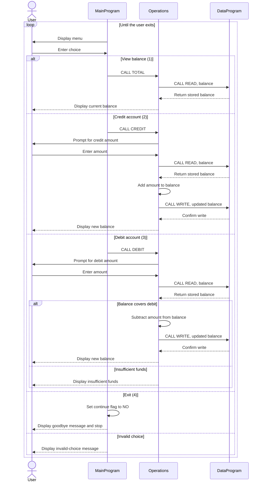

# COBOL Student Account Management

This directory documents the COBOL account-management example in `src/cobol/`. The program provides a command-line menu for viewing and updating an account balance. Although it can serve as a starting point for student account workflows, the current implementation manages one shared balance and does not identify individual students.

## Source Files

### `main.cob` - `MainProgram`

Entry point and command-line menu. It repeatedly prompts the user to view the balance, credit the account, debit the account, or exit. It dispatches the first three choices to `Operations` with the operation codes `TOTAL `, `CREDIT`, and `DEBIT `, respectively. Invalid menu choices display an error and return to the menu.

### `operations.cob` - `Operations`

Implements account actions:

- `TOTAL ` reads the stored balance and displays it.
- `CREDIT` accepts an amount, reads the current balance, adds the amount, writes the updated balance, and displays it.
- `DEBIT ` accepts an amount and checks that the current balance is at least that amount. If so, it subtracts and stores the amount; otherwise, it reports insufficient funds without changing the balance.

### `data.cob` - `DataProgram`

Owns the balance in working storage and provides a small read/write interface. A `READ` operation copies the stored balance to the caller; a `WRITE` operation copies the caller's balance into storage. The initial balance is `1000.00`.

## Account Rules and Current Limitations

- The balance uses `PIC 9(6)V99`: six whole-number digits and two implied decimal digits.
- A debit is allowed only when the requested amount is no greater than the current balance. A rejected debit leaves the balance unchanged.
- Credits are added directly. There is no explicit validation for zero, negative, or out-of-range amounts.
- The balance is held in program working storage. It is shared by operations during a program run, but is not saved to a file or database for later runs.
- There are no student IDs, names, separate student balances, tuition rules, payment history, or account-specific authorization. As written, all actions affect the same account balance.

## Call Flow

`MainProgram` reads the menu choice and calls `Operations`. `Operations` handles the requested action and calls `DataProgram` to read or update the balance. `DataProgram` returns control to its caller, and the menu continues until the user selects Exit.

## Sequence Diagram

